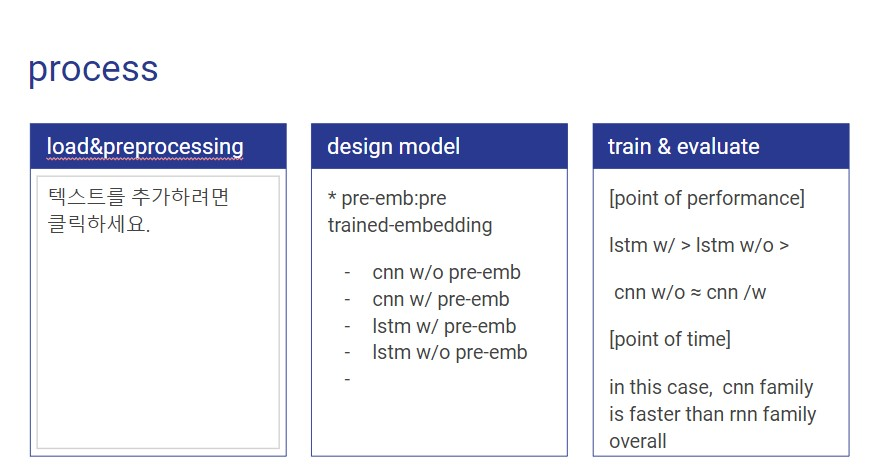
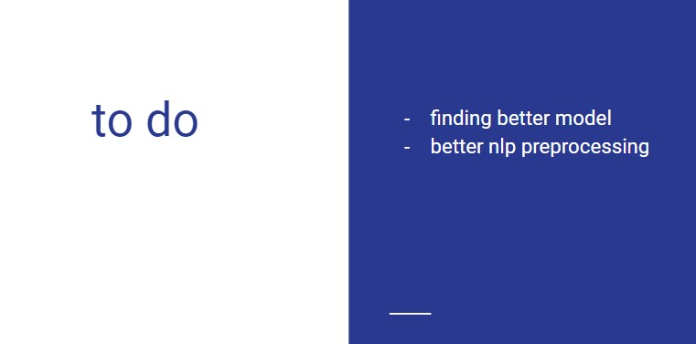

### Experiment

(In point of accuracy)
- pre-trained embedding vs embedding
    pretrained > embedding (conv ,lstm)
- lstm(55) vs conv  
    lstm(55) > conv   
- mixed model(pre-emd&conv&lstm) vs each  model (cnn ,lstm)
    mixed model > single model
- mixed model(pre-emd&conv&GRU(25)) vs mixed model(pre-emd&conv&lstm)
    mixed model(pre-emd&conv&GRU(25)) > mixed model(pre-emd&conv&lstm)

### to do 

- [ ] How to do better NLP preprocessing analysis  
- [ ] autoML(DL)  
- [ ] Improving performance ,what kind of methods there are in general. 
- [ ] using Bert model
